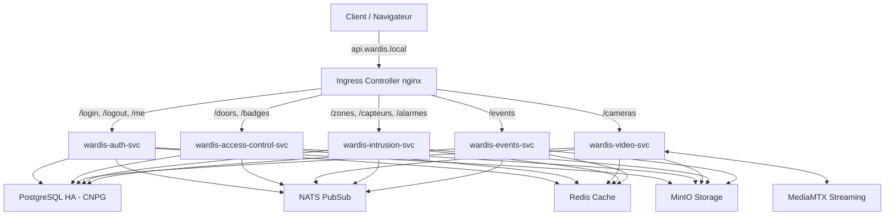

# Déploiement de Wardis Server sur Kubernetes

Ce dossier contient l'ensemble des manifests Kubernetes permettant de déployer l'application **Wardis Server** et son infrastructure dans un cluster Kubernetes.

---

## 🏗️ Architecture du Déploiement

Bien que le code Go de l'application soit structuré en un seul binaire (`cmd/server/main.go`), nous le déployons sous forme de **5 microservices indépendants** dans Kubernetes :
1. `wardis-auth` : Gestion de l'authentification et sessions utilisateur.
2. `wardis-access-control` : Gestion des badges, portes et journaux d'accès.
3. `wardis-video` : Gestion des caméras et flux vidéo.
4. `wardis-intrusion` : Contrôle des zones, capteurs et alarmes.
5. `wardis-events` : Abonnement aux événements NATS et flux temps réel (SSE).

L'**Ingress (API Gateway)** écoute sur le domaine `api.wardis.local` et route le trafic HTTP vers le service approprié selon les préfixes d'URL (ex: `/login` vers `wardis-auth-svc`, `/doors` vers `wardis-access-control-svc`).

### Schéma de l'Infrastructure


---

## 📋 Prérequis

1. Un cluster Kubernetes (ex: **Minikube**, **Kind**, ou un cluster cloud managé).
2. L'outil CLI **`kubectl`** configuré.
3. L'**Ingress Controller Nginx** activé dans votre cluster :
   - Pour **Minikube** : `minikube addons enable ingress`
   - Pour les autres clusters :
     ```bash
     kubectl apply -f https://raw.githubusercontent.com/kubernetes/ingress-nginx/controller-v1.10.1/deploy/static/provider/cloud/deploy.yaml
     ```
4. L'opérateur **CloudNativePG** (CNPG) pour la gestion PostgreSQL en Haute Disponibilité :
   ```bash
   kubectl apply -f https://raw.githubusercontent.com/cloudnative-pg/cloudnative-pg/release-1.23/releases/cnpg-1.23.1.yaml
   ```
   *(Attendez quelques instants que le pod de l'opérateur soit prêt avant de continuer).*

---

## 🚀 Étapes de Déploiement

### 1. Construire et charger l'image Docker de l'application
Depuis la racine du projet, compilez l'image Docker contenant le binaire Go et les migrations SQL :
```bash
docker build -t wardis-server:latest .
```

Si vous utilisez un cluster local, chargez l'image dans l'environnement de votre cluster :
- **Minikube** : `minikube image load wardis-server:latest`
- **Kind** : `kind load docker-image wardis-server:latest`

---

### 2. Appliquer les ressources Kubernetes

Exécutez les commandes suivantes dans l'ordre pour configurer le namespace et démarrer les composants :

#### A. Namespace & Configurations
```bash
# 1. Créer le namespace dédié
kubectl apply -f namespace.yaml

# 2. Déployer les configurations et secrets applicatifs
kubectl apply -f configmap.yaml
kubectl apply -f secrets.yaml
```

#### B. Base de Données HA (CloudNativePG)
```bash
# 3. Lancer la base de données PostgreSQL en HA (3 pods)
kubectl apply -f postgres-cnpg.yaml
```
*(CNPG va automatiquement créer les secrets, le StatefulSet et 3 services dont `wardis-postgres-rw` pour les écritures et `wardis-postgres-ro` pour les lectures).*

#### C. Services d'Infrastructure
```bash
# 4. Déployer Redis, NATS, MinIO et MediaMTX
kubectl apply -f redis.yaml
kubectl apply -f nats.yaml
kubectl apply -f minio.yaml
kubectl apply -f mediamtx.yaml
```

#### D. Microservices Applicatifs & Gateway
```bash
# 5. Déployer les 5 composants applicatifs
kubectl apply -f auth.yaml
kubectl apply -f access-control.yaml
kubectl apply -f video.yaml
kubectl apply -f intrusion.yaml
kubectl apply -f events.yaml

# 6. Déployer l'Ingress pour router le trafic externe
kubectl apply -f ingress.yaml
```

---

## 🩺 Vérification du Déploiement

Pour vérifier que tout s'est bien déployé :
```bash
kubectl get all -n wardis
```

Pour surveiller l'état du cluster PostgreSQL HA :
```bash
kubectl get cluster -n wardis wardis-postgres
```

---

## 🌐 Accéder à l'API en local

Afin de pouvoir requêter l'API via le nom de domaine configuré dans l'Ingress (`api.wardis.local`), vous devez associer ce nom de domaine à l'IP de votre cluster.

### Étape 1 : Récupérer l'IP du contrôleur Ingress
- Avec **Minikube** :
  ```bash
  minikube ip
  ```
- Avec un cluster standard (cherchez l'adresse IP sous la colonne `ADDRESS`) :
  ```bash
  kubectl get ingress -n wardis wardis-api-gateway
  ```

### Étape 2 : Mettre à jour votre fichier `hosts`
Ajoutez la ligne suivante à votre fichier `/etc/hosts` (sous Linux/macOS) ou `C:\Windows\System32\drivers\etc\hosts` (sous Windows en mode Administrateur) :
```text
<IP_INGRESS> api.wardis.local
```
*(Remplacez `<IP_INGRESS>` par la valeur récupérée à l'étape précédente).*

### Étape 3 : Tester l'authentification
Vous pouvez tester que le routage Ingress fonctionne en vous connectant à l'aide de l'utilisateur administrateur par défaut (inséré au démarrage) :
```bash
curl -X POST http://api.wardis.local/login \
  -H "Content-Type: application/json" \
  -d '{"email":"admin@wardis.com", "password":"password"}'
```
Vous devriez recevoir une réponse JSON contenant un token JWT et le cookie de session associé.

---

## ⚙️ Administration & Mise à l'échelle (Scaling)

### Passer à l'échelle un microservice spécifique
Chaque microservice s'exécute de manière isolée. Si le service vidéo subit une charge importante, vous pouvez augmenter son nombre de réplicas de manière indépendante :
```bash
kubectl scale deployment wardis-video -n wardis --replicas=5
```

### Consulter les logs d'un service
```bash
kubectl logs -f deployment/wardis-auth -n wardis --tail=100
```
